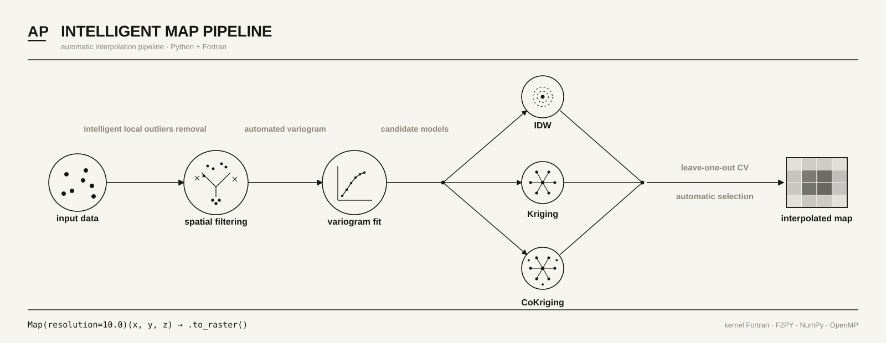

# APBase — Intelligent Map-Generation Pipeline

[](pyproject.toml)
[](LICENSE)
[](pyproject.toml)
[](#high-performance)
[](#high-performance)
[](pyproject.toml)
[](https://github.com/ap-base/apbase-python/actions/workflows/ci.yml)
[](https://github.com/ap-base/apbase-python/actions/workflows/build.yml)
[]()

<p align="center">
  
</p>

**APBase is an intelligent, high-performance map-generation package for
precision agriculture.**

It turns irregular field data — yield, soil, sensors, operations — into
reliable maps without asking the user to hand-pick the math behind each run.

The main idea is simple: APBase prepares the data, removes spatial noise,
fits the variogram, cross-validates the candidate interpolation models, and
uses the mathematical model with the lowest validation error for that
dataset. In the high-level `Map` pipeline, the package currently chooses
between IDW and local ordinary kriging; advanced co-kriging tools remain
available from submodules when secondary variables are part of the workflow.

This is not a generic geostatistics toolbox. It is production infrastructure
for Agent and MCP pipelines that need low latency, reproducible results, and
maps with the smallest validation error APBase can obtain from the available
models and data.

## What this package does

The main entry point is `apbase.Map`.

Given `x`, `y`, `z`, and a resolution, the package automatically runs:

1. validation and filtering of the source points;
2. removal of invalid data, global outliers, and local spatial outliers;
3. fitting of an automated variogram;
4. leave-one-out cross-validation between candidate interpolation models;
5. automatic selection of the mathematical model with the lowest RMSE;
6. final interpolation of the map.

<p align="center">
  
</p>

## Recommended API

The public top-level API is intentionally small:

- **`apbase.Map`**: the recommended automated pipeline for creating maps.
- **`apbase.create_map`**: functional shortcut for one-shot map generation.
- **`apbase.config`**: runtime configuration, including OpenMP thread count.

Lower-level tools such as spatial filters, grids, variograms, IDW, kriging,
cross-validation, coordinate conversion, and co-kriging are still available
from their submodules for advanced workflows. They are not the normal entry
point for users who only need to create maps.

## High performance

APBase is built on a numerical kernel written in Fortran: the critical
routines run as precompiled native extensions, integrated with Python via
F2PY, NumPy, and OpenMP.

This is what makes APBase suitable for AI Agents and MCP servers:
low-latency responses, predictable CPU cost, and deterministic results —
without relying on Python loops or reimplementing geostatistics in every
agent. The package avoids full distance matrices and works with local
neighborhoods, neighbor limits, and internal spatial structures to keep
cost and memory under control on dense agricultural data.

## Usage

### Quick usage

```python
import numpy as np

import apbase
from apbase import Map

apbase.config["n_threads"] = 4

x = np.ascontiguousarray(x_metric, dtype=np.float64)
y = np.ascontiguousarray(y_metric, dtype=np.float64)
z = np.ascontiguousarray(values, dtype=np.float64)

result = Map(
    resolution=10.0,
)(x, y, z)

result.method                  # "idw" or "kriging", selected by validation error
result.x, result.y, result.z   # compact points within the boundary

X, Y, Z = result.to_raster()   # (ny, nx) arrays, NaN outside the boundary
```

Equivalent functional shortcut:

```python
import apbase

result = apbase.create_map(x, y, z, resolution=10.0)
```

### Manual control

The top-level namespace stays focused on map creation. Use lower-level
classes from submodules when you need to inspect intermediate steps, force a
specific method, or build an advanced workflow such as co-kriging.

```python
from apbase.cross_validate import cross_validate
from apbase.filtering import SpatialFilter
from apbase.grid import Grid
from apbase.idw import IDW
from apbase.kriging import Kriging

spatial_filter = SpatialFilter(filter_level="light").fit(x, y, z)
x_filtered, y_filtered, z_filtered = spatial_filter.filter()

targets = Grid(resolution=10.0).generate(x_filtered, y_filtered)
cv = cross_validate(x_filtered, y_filtered, z_filtered)

kriging = Kriging().fit(
    x_filtered, y_filtered, z_filtered
)
z_kriging = kriging.interpolate(targets)

idw = IDW().fit(
    x_filtered, y_filtered, z_filtered
)
z_idw = idw.interpolate(targets)
```

### Data requirements

- `x`, `y`, and `z` must be one-dimensional arrays.
- Projected/metric coordinates, such as UTM, are used directly.
- Geographic lon/lat input is detected by `Map`, converted internally to
  metric coordinates for distance calculations, and restored in the output.
- `resolution`, `radius`, and `bounds` are interpreted in the coordinate
  system used by the pipeline. For geographic input, distance-based settings
  such as `resolution` are metric.
- For best performance, use contiguous `float64` arrays.

### Global configuration

The number of OpenMP threads is a process-level setting. Set it before
creating instances:

```python
import apbase

apbase.config["n_threads"] = 4
```

## Installation

```bash
pip install apbase

# For the latest development version, install directly from the repository:
pip install git+https://github.com/ap-base/apbase-python.git
```

For local development:

```bash
git clone https://github.com/ap-base/apbase-python.git
cd apbase-python
pip install -e .
```

## Dependencies

- Python >= 3.12
- `numpy >= 2.0`
- `pyproj >= 3.6, < 4.0`
- `shapely >= 2.0, < 3.0`

Precompiled Fortran/OpenMP native extensions ship with the wheel — no
separate compiler or BLAS/LAPACK installation is required at runtime.

## APBase ecosystem

APBase's vision goes beyond this package: to be the numerical foundation
that AI Agents and MCP servers for precision agriculture query for data
from farm machinery, sensors, soil, climate, operations, and remote sensing.

This repository is the high-performance geospatial core of that ecosystem.
Climate pipelines, satellite imagery, platform APIs, Agents, and MCP
servers should consume this package as a dependency, living in separate
modules or services.

## License

Apache License 2.0. See [LICENSE](LICENSE).
